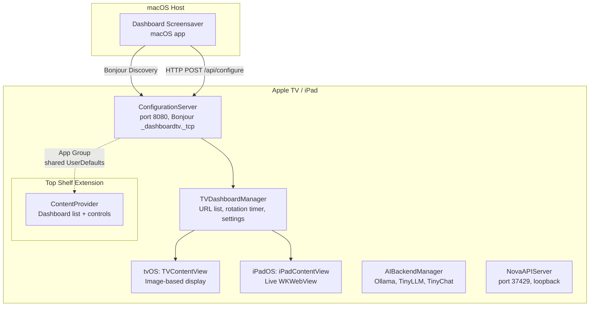

# DashboardTV

[](https://github.com/kochj23/DashboardTV/actions)


[](LICENSE)


A multi-platform tvOS and iPadOS companion app for
[Dashboard Screensaver](https://github.com/kochj23/DashboardScreensaver).
Displays configurable dashboard URLs on Apple TV and iPad devices, managed
remotely from the macOS Dashboard Screensaver app via Bonjour service
discovery and a built-in HTTP configuration server.

---

## Table of Contents

- [Architecture](#architecture)
- [Features](#features)
- [Requirements](#requirements)
- [Installation](#installation)
- [Usage](#usage)
- [Configuration API](#configuration-api)
- [AI Backend Integration](#ai-backend-integration)
- [Nova API Server](#nova-api-server)
- [Top Shelf Extension](#top-shelf-extension)
- [Project Structure](#project-structure)
- [Building from Source](#building-from-source)
- [License](#license)
- [Author](#author)

---

## Architecture



### Data Flow

1. **Discovery** -- The macOS Dashboard Screensaver app finds DashboardTV
   instances on the local network via Bonjour (`_dashboardtv._tcp`).
2. **Configuration** -- The Mac pushes a JSON payload of dashboard URLs and
   settings to the device over HTTP (port 8080).
3. **Display** -- On tvOS the app renders dashboard metadata and screenshot
   images (tvOS has no WKWebView). On iPadOS the app loads live dashboards
   in a full-screen WKWebView.
4. **Rotation** -- A configurable timer cycles through dashboards
   automatically. The Siri Remote (tvOS) or touch gestures (iPad) provide
   manual navigation.
5. **Top Shelf** -- The tvOS Top Shelf extension reads shared state via an
   App Group and displays the current dashboard, saved dashboards, and
   rotation controls directly from the Apple TV home screen.
6. **AI (optional)** -- An AI backend manager can connect to Ollama,
   TinyLLM, or TinyChat to suggest time-aware dashboard priority ordering.

---

## Features

### Core
- **Remote Configuration** -- Receive dashboard URLs and settings from the
  macOS Dashboard Screensaver app via Bonjour discovery and HTTP.
- **Auto-Rotation** -- Cycle through configured dashboards on a
  configurable interval (default 30 seconds).
- **Persistent Settings** -- All configuration is saved to UserDefaults and
  survives app restarts.
- **IP Address Display** -- Shows the device IP on the empty-state screen
  so the Mac can find it easily.

### tvOS
- **Siri Remote Controls** -- Play/Pause toggles rotation; Left/Right
  arrows navigate between dashboards.
- **Status Overlay** -- Rotation state indicator and dashboard counter
  displayed over content.
- **Top Shelf Extension** -- Quick-access dashboard list and rotation
  toggle from the Apple TV home screen.

### iPadOS
- **Live WKWebView Rendering** -- Displays actual interactive dashboards,
  not just screenshots.
- **Touch Gestures** -- Swipe left/right to navigate; tap to show/hide
  floating playback controls.
- **Floating Controls Overlay** -- Play/pause and prev/next buttons in a
  glassmorphic overlay.

### AI Integration (Optional)
- **Multi-Backend Support** -- Ollama, TinyLLM (by Jason Cox), and
  TinyChat (by Jason Cox).
- **Auto Backend Selection** -- Automatically detects and connects to the
  best available local AI backend.
- **Dashboard Priority Suggestions** -- AI-powered time-of-day-aware
  dashboard ordering.
- **Status Menu** -- Real-time backend connection status with model picker
  for Ollama.

### Nova / OpenClaw API
- **Local HTTP API** on port 37429 (loopback only) for status and health
  checks.
- Endpoints: `GET /api/status`, `GET /api/ping`.
- Authenticated via `X-Nova-Token` header for tvOS requests.

---

## Requirements

| Requirement                        | Minimum          |
|------------------------------------|------------------|
| tvOS                               | 17.0             |
| iPadOS                             | 17.0             |
| Xcode                              | 15.0             |
| Swift                              | 5.9              |
| Apple TV hardware                  | 4K (2nd gen+)    |
| macOS companion app                | Dashboard Screensaver |
| AI backends (optional)             | Ollama / TinyLLM / TinyChat |

---

## Installation

### From Xcode

1. Clone the repository:
   ```bash
   git clone git@github.com:kochj23/DashboardTV.git
   cd DashboardTV
   ```
2. Open `DashboardTV.xcodeproj` in Xcode 15 or later.
3. Select the **DashboardTV** scheme and your Apple TV or iPad as the
   destination.
4. Build and run (Cmd+R).

### Using XcodeGen

The project includes a `project.yml` for XcodeGen. To regenerate the
Xcode project:

```bash
cd /Volumes/Data/xcode/DashboardTV
xcodegen generate
open DashboardTV.xcodeproj
```

### Deploy to Apple TV

With the Apple TV connected over USB or paired on the same network:

```bash
xcodebuild -project DashboardTV.xcodeproj \
  -scheme DashboardTV \
  -destination 'generic/platform=tvOS' \
  -configuration Release \
  build
```

Then deploy through Xcode's Devices & Simulators window or via
`ios-deploy`.

---

## Usage

### First Launch

1. Install DashboardTV on your Apple TV or iPad.
2. Launch the app. The empty-state screen displays the device IP address
   and a "Ready for configuration" indicator.
3. Open **Dashboard Screensaver** on your Mac.
4. Add the Apple TV or iPad in the Apple TV Manager section using the
   displayed IP address.
5. Configure dashboard URLs and push them to the device.

### Controls

#### Apple TV (Siri Remote)

| Button      | Action                        |
|-------------|-------------------------------|
| Play/Pause  | Toggle auto-rotation on/off   |
| Left        | Previous dashboard            |
| Right       | Next dashboard                |

#### iPad (Touch)

| Gesture       | Action                      |
|---------------|-----------------------------|
| Swipe Left    | Next dashboard              |
| Swipe Right   | Previous dashboard          |
| Tap           | Show/hide playback controls |

---

## Configuration API

DashboardTV runs an HTTP server on **port 8080** that accepts
configuration from the macOS companion app. The device advertises itself
via Bonjour as `_dashboardtv._tcp`.

### Push Configuration

```
POST /api/configure
Content-Type: application/json
```

```json
{
  "urls": [
    "https://grafana.example.com/d/abc123",
    "https://dashboard.example.com/status"
  ],
  "rotationInterval": 30,
  "enableDarkMode": true,
  "enableAIDetection": false,
  "alertThreshold": 5.0
}
```

| Field              | Type     | Default | Description                          |
|--------------------|----------|---------|--------------------------------------|
| urls               | [String] | []      | Dashboard URLs to display            |
| rotationInterval   | Double   | 30      | Seconds between dashboard rotations  |
| enableDarkMode     | Bool     | true    | Dark mode UI theme                   |
| enableAIDetection  | Bool     | false   | AI-powered dashboard prioritization  |
| alertThreshold     | Double   | 5.0     | Alert sensitivity threshold          |

### Device Info

```
GET /api/info
```

Returns device metadata for the macOS companion app.

---

## AI Backend Integration

DashboardTV includes an optional AI backend manager that connects to local
LLM servers for intelligent dashboard management.

### Supported Backends

| Backend   | Default URL                  | Protocol             | Attribution                                         |
|-----------|------------------------------|----------------------|-----------------------------------------------------|
| Ollama    | http://localhost:11434       | Ollama native API    | --                                                  |
| TinyLLM   | http://localhost:8000        | OpenAI-compatible    | TinyLLM by Jason Cox (github.com/jasonacox/TinyLLM) |
| TinyChat  | http://localhost:8000        | OpenAI-compatible    | TinyChat by Jason Cox (github.com/jasonacox/tinychat)|

### Auto Mode

When the backend is set to **Auto (Prefer Local)**, the manager probes
each backend in order (Ollama, TinyChat, TinyLLM) and selects the first
one that responds. The status menu widget shows the active backend and
connection state in real time.

### AI Features

- **Dashboard Priority Suggestions** -- Given a list of dashboard URLs and
  the current hour, the AI suggests an optimal viewing order based on
  business-hours relevance and typical usage patterns.

---

## Nova API Server

A lightweight HTTP API server runs on **port 37429** (bound to 127.0.0.1
only) for integration with Nova (OpenClaw AI) and Claude Code.

### Endpoints

| Method | Path          | Description                            |
|--------|---------------|----------------------------------------|
| GET    | /api/status   | App status, version, port, uptime      |
| GET    | /api/ping     | Health check (returns `{"pong":"true"}`)|

### Example

```bash
curl -s http://127.0.0.1:37429/api/status | python3 -m json.tool
```

```json
{
  "status": "running",
  "app": "DashboardTV",
  "version": "1.0",
  "port": "37429",
  "uptimeSeconds": 3600
}
```

The server starts automatically on launch and accepts no external
connections.

---

## Top Shelf Extension

The **DashboardTVTopShelf** target is a tvOS Top Shelf extension that
displays dashboard information directly on the Apple TV home screen when
the DashboardTV app is in the top row.

### Sections

| Section           | Items                                              |
|-------------------|----------------------------------------------------|
| DashboardTV       | Current dashboard URL, rotation toggle              |
| Saved Dashboards  | Up to 5 configured dashboards (deep-linked)         |

Data is shared between the main app and the extension through an App Group
(`group.com.jordankoch.dashboardtv`) using shared UserDefaults.

---

## Project Structure

```
DashboardTV/
|-- DashboardTV/
|   |-- DashboardTVApp.swift          App entry point, ConfigurationServer,
|   |                                 TVDashboardManager, data models
|   |-- NovaAPIServer.swift           Nova/Claude local HTTP API (port 37429)
|   |-- PlatformHelpers.swift         Platform detection, adaptive fonts,
|   |                                 view modifiers (glass background, etc.)
|   |-- TopShelfDataManager.swift     App Group data sync for Top Shelf
|   |-- DashboardTV.entitlements      App entitlements
|   |-- Assets.xcassets/              App icons and accent color
|   |-- Managers/
|   |   |-- AIBackendManager.swift    Multi-backend AI manager (Ollama,
|   |   |                             TinyLLM, TinyChat)
|   |   |-- AIBackendStatusMenu.swift SwiftUI status widget
|   |-- Views/
|       |-- TVContentView.swift       tvOS main UI (image-based dashboards)
|       |-- iPadContentView.swift     iPadOS main UI (WKWebView dashboards)
|
|-- DashboardTVTopShelf/
|   |-- ContentProvider.swift         Top Shelf extension content provider
|
|-- Shared/                           Shared resources (reserved)
|-- project.yml                       XcodeGen project definition
|-- LICENSE                           MIT License
|-- SECURITY.md                       Security policy
|-- CHANGELOG.md                      Version history
|-- CONTRIBUTING.md                   Contribution guidelines
|-- CODE_OF_CONDUCT.md                Code of conduct
|-- .github/
    |-- workflows/                    CI/CD build workflow
    |-- social-preview.png            GitHub social preview image
```

---

## Building from Source

### Prerequisites

- Xcode 15.0 or later
- XcodeGen (optional, for regenerating the project file):
  ```bash
  brew install xcodegen
  ```

### Build

```bash
# Generate project (if using XcodeGen)
cd /Volumes/Data/xcode/DashboardTV
xcodegen generate

# Build for tvOS
xcodebuild -project DashboardTV.xcodeproj \
  -scheme DashboardTV \
  -destination 'generic/platform=tvOS' \
  -configuration Release \
  build

# Build for iPadOS
xcodebuild -project DashboardTV.xcodeproj \
  -scheme DashboardTV \
  -destination 'generic/platform=iOS' \
  -configuration Release \
  build
```

### Configuration Scripts

The project includes several Ruby helper scripts for advanced setup:

| Script                    | Purpose                                   |
|---------------------------|-------------------------------------------|
| add_topshelf_target.rb    | Adds the Top Shelf extension target       |
| configure_app_groups.rb   | Configures App Group entitlements         |
| fix_bundle_ids.rb         | Fixes bundle identifier consistency       |
| fix_topshelf_paths.rb     | Corrects Top Shelf file path references   |

---

## Testing

The project includes an XCTest suite covering models, configuration codability, AI backend types, and security.

### Test Suites

| Suite | Tests | Coverage |
|-------|-------|----------|
| TVConfigurationTests | 4 | Codable round-trip, empty URLs, large URL list, minimal config |
| TVSettingsTests | 3 | Default values, codable, modification |
| AIBackendTests | 5 | All cases, raw values, icons, descriptions, attribution, codable |
| AIBackendErrorTests | 2 | Error descriptions exist and are non-empty |
| URLSafetyTests | 3 | Valid URL construction, edge cases, malicious URLs, decodability |
| DashboardTVSecurityTests | 5 | No hardcoded credentials, loopback API, correct port, response security, app group ID, UserDefaults safety |

### Running Tests

```bash
# Build tests for tvOS Simulator
xcodebuild build-for-testing -project DashboardTV.xcodeproj \
  -scheme DashboardTVTests \
  -destination 'generic/platform=tvOS Simulator'

# Run on a connected Apple TV
xcodebuild test -project DashboardTV.xcodeproj \
  -scheme DashboardTVTests \
  -destination 'platform=tvOS,name=Living Room'
```

---

## License

MIT License

Copyright (c) 2026 Jordan Koch

Permission is hereby granted, free of charge, to any person obtaining a
copy of this software and associated documentation files (the "Software"),
to deal in the Software without restriction, including without limitation
the rights to use, copy, modify, merge, publish, distribute, sublicense,
and/or sell copies of the Software, and to permit persons to whom the
Software is furnished to do so, subject to the following conditions:

The above copyright notice and this permission notice shall be included in
all copies or substantial portions of the Software.

THE SOFTWARE IS PROVIDED "AS IS", WITHOUT WARRANTY OF ANY KIND, EXPRESS OR
IMPLIED, INCLUDING BUT NOT LIMITED TO THE WARRANTIES OF MERCHANTABILITY,
FITNESS FOR A PARTICULAR PURPOSE AND NONINFRINGEMENT. IN NO EVENT SHALL
THE AUTHORS OR COPYRIGHT HOLDERS BE LIABLE FOR ANY CLAIM, DAMAGES OR OTHER
LIABILITY, WHETHER IN AN ACTION OF CONTRACT, TORT OR OTHERWISE, ARISING
FROM, OUT OF OR IN CONNECTION WITH THE SOFTWARE OR THE USE OR OTHER
DEALINGS IN THE SOFTWARE.

---

## Author

Written by **Jordan Koch** ([kochj23](https://github.com/kochj23))

---

> **Disclaimer:** This is a personal project created on my own time. It is
> not affiliated with, endorsed by, or representative of my employer.
